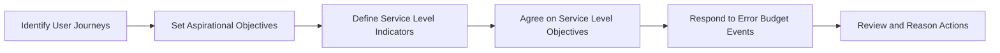

+++
title = '2023 11 04 First Post'
date = 2023-11-04T21:14:25+11:00
draft = true
tags = ["sre", "observability"]
+++

## Testing  1 2 3 

This is one of the first posts

```mermaid
    flowchart LR
        A[Identify User Journeys]-->B[Set Aspirational Objectives]
        B-->C[Define Service Level Indicators]
        C-->D[Agree on Service Level Objectives]
        D-->E[Respond to Error Budget Events]
        E-->F[Review and Reason Actions]
```
